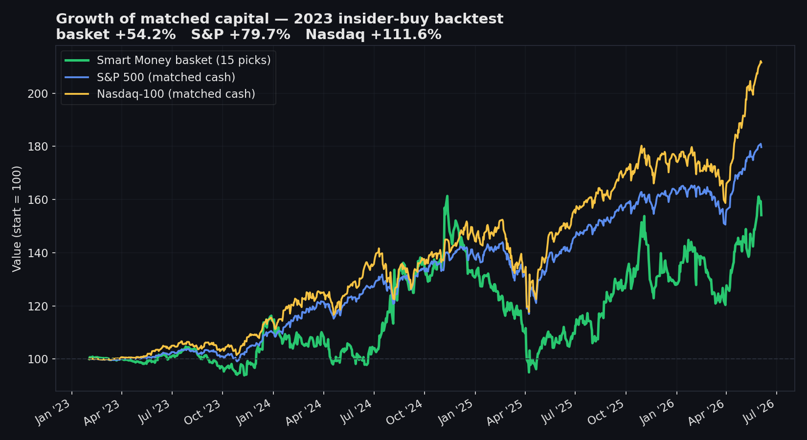
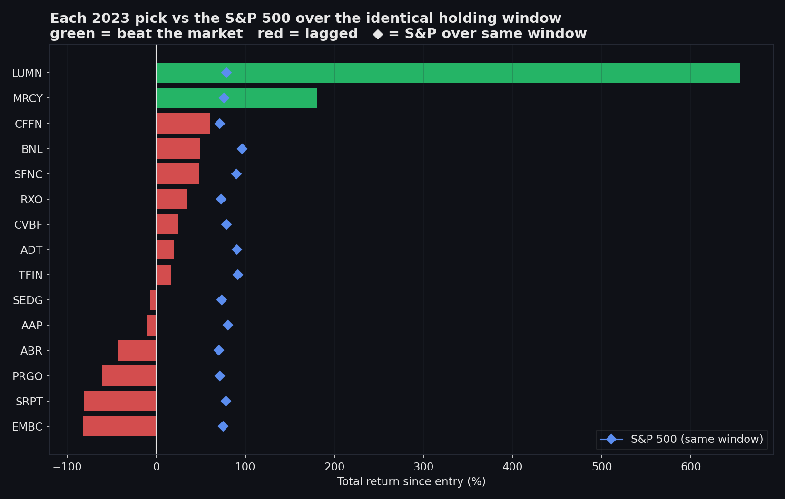
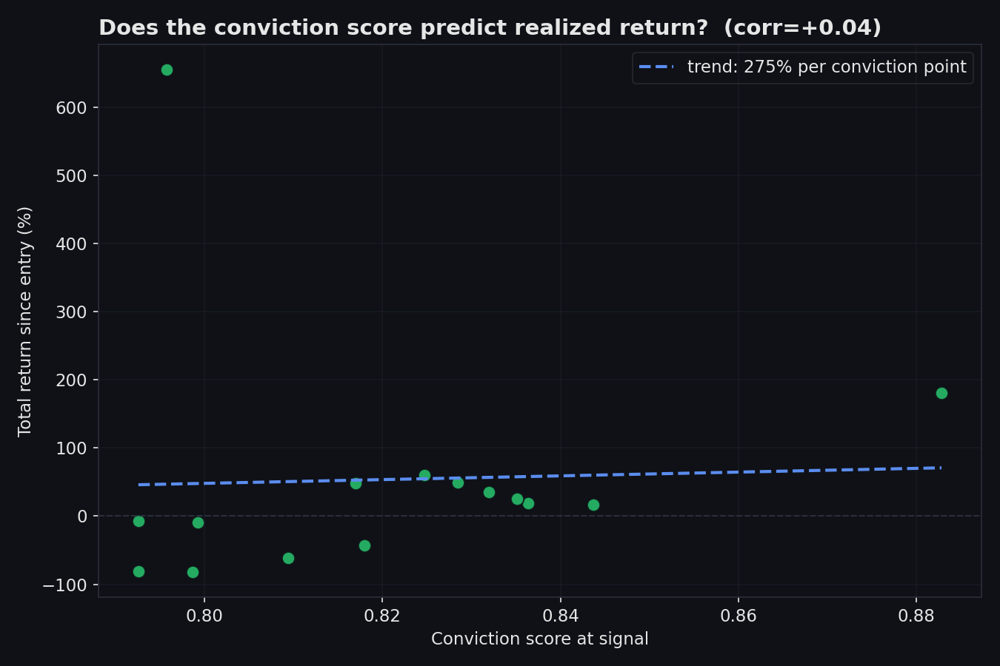
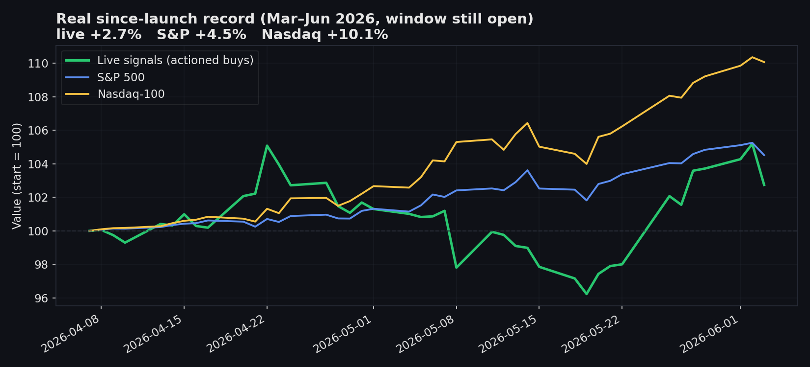

# Smart Money Follows — Validation Results

*Auto-generated from the latest backtest run. See [METHODOLOGY.md](METHODOLOGY.md) for how these are computed and their limitations.*

## Pillar 1 — 2023 point-in-time backtest

- **Universe:** S&P SmallCap 600 (Wikipedia constituents) — 1533 open-market insider buys scanned, 1409 scored.
- **Portfolio (top 15, equal weight, to date):** **+54.2%**
- **S&P 500 (matched cash, same windows):** +79.7%
- **Nasdaq-100 (matched cash, same windows):** +111.6%
- **Picks that beat the S&P 500:** 2/15
- **Unfiltered universe avg (all 226 names, to date):** +98.7% — vs top-15 avg +53.7% (does the conviction ranking add value?)

**Average return by horizon (top 15):**

| Horizon | 1m | 3m | 6m | 12m | To date |
|---|---|---|---|---|---|
| Avg | +6.5% | +2.4% | -1.1% | +44.3% | +53.7% |
| Median | +6.2% | +4.3% | -2.2% | +16.0% | +19.3% |

**The 15 picks:**

| # | Ticker | Conviction | Entry | To-date | S&P (same window) | Beat? |
|---|--------|-----------|-------|---------|-------------------|-------|
| 1 | MRCY | 0.883 | 2023-08-23 | +180.7% | +76.3% | ✅ |
| 2 | TFIN | 0.844 | 2023-02-01 | +16.7% | +91.5% | ❌ |
| 3 | ADT | 0.836 | 2023-05-09 | +19.3% | +90.7% | ❌ |
| 4 | CVBF | 0.835 | 2023-11-03 | +25.0% | +79.0% | ❌ |
| 5 | RXO | 0.832 | 2023-11-16 | +34.9% | +72.8% | ❌ |
| 6 | BNL | 0.829 | 2023-03-21 | +49.5% | +96.5% | ❌ |
| 7 | CFFN | 0.825 | 2023-11-29 | +60.3% | +71.2% | ❌ |
| 8 | ABR | 0.818 | 2023-11-30 | -42.5% | +70.5% | ❌ |
| 9 | SFNC | 0.817 | 2023-05-05 | +47.9% | +89.9% | ❌ |
| 10 | PRGO | 0.809 | 2023-11-20 | -61.3% | +71.3% | ❌ |
| 11 | AAP | 0.799 | 2023-06-12 | -9.8% | +80.7% | ❌ |
| 12 | EMBC | 0.799 | 2023-08-11 | -82.4% | +75.2% | ❌ |
| 13 | LUMN | 0.796 | 2023-11-06 | +655.7% | +78.6% | ✅ |
| 14 | SEDG | 0.793 | 2023-11-14 | -7.1% | +73.4% | ❌ |
| 15 | SRPT | 0.793 | 2023-11-07 | -80.8% | +78.1% | ❌ |

_Methodology: point-in-time backtest; live conviction engine; PIT inputs; next-day entry; liquidity-tier costs; delisted names exit at last traded price; benchmarks SPY/QQQ matched-cash._

## Pillar 2 — real since-launch track record (Mar–Jun 2026)

- **Actionable buy signals (conviction ≥ 0.6):** 89 rows → 31 tickers (4 bad records dropped)
- **Live portfolio (to date):** **+2.7%**
- **S&P 500 / Nasdaq-100 (matched):** +4.5% / +10.1%
- **Beating the S&P 500:** 11/31
- _Window opened Mar-May 2026 and is still running; holding periods are weeks, not years._

## Charts

---

*Not investment advice. Backtested/hypothetical results have inherent limitations and do not represent actual trading. Past performance does not guarantee future results.*